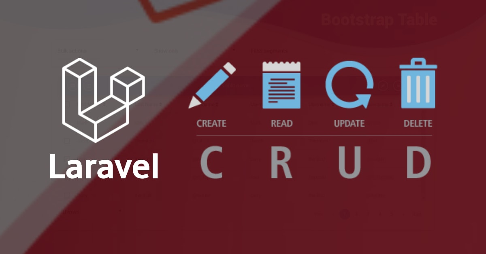

This project implements a simple PHP-backed application for Laravel CRUD test. 

* The application architecture is MVC and implemented with PHP Laravel.
* The front-end application used Vue.js to implement the customer panel with require.js to manage JavaScript library loading in the browser.
* The database is MySQL, and the relationships between the tables are defined.
* The event-driven architecture is implemented with the RabbitMQ driver.
* You could see simple events and consumers in the code base.
* Security is so simple and powered by JWT tokens that can be kept for 1 hour each.
* The application used Docker Compose to run all components. 
* The integration tests are implemented by using the PHPUnit library. 
* The Behavior tests are implemented by using the Cucumber and Bhat library. 

## Table of Contents
- [Overview](#overview)
- [Setup environment](#setup-environment)
- [Build backend](#build-backend)
- [Build frontend](#build-frontend)
- [Run Unit Tests](#unit-tests)
- [Run BDD Tests](#bdd-tests)
- [Run Rabbitmq consumer](#rabbitmq-consumer)

### Overview
<p align="center"></p>

### Setup environment

we could run environment with 
	
```sh
docker-compose up
``` 

### Build backend
build data base tables and default data : 

```sh
docker-compose exec app sh 
composer self-update --2

composer i
cp .env.example .env

php artisan key:generate

php artisan migrate

php artisan db:seed
 
```


### Build frontend
build front end application  : 

```sh
docker-cmpose exec front sh 
npm i
npm run prod
 
```

now you can open the "http://127.0.0.1:4000/" url in your browser and test app

### Unit Tests
run unit tests: 

```sh
php vendor/bin/phpunit  --testdox  tests/ 
```

### BDD Tests
run BDD (Behavior-Driven Development) tests: 

```sh

java -jar ./selenium-server-standalone-3.141.59.jar


```


### Rabbitmq consumer

run rabbitmq consumer for email : 
```sh
docker-cmpose exec app sh 
php src/Consumers/Mail.php
 
```


